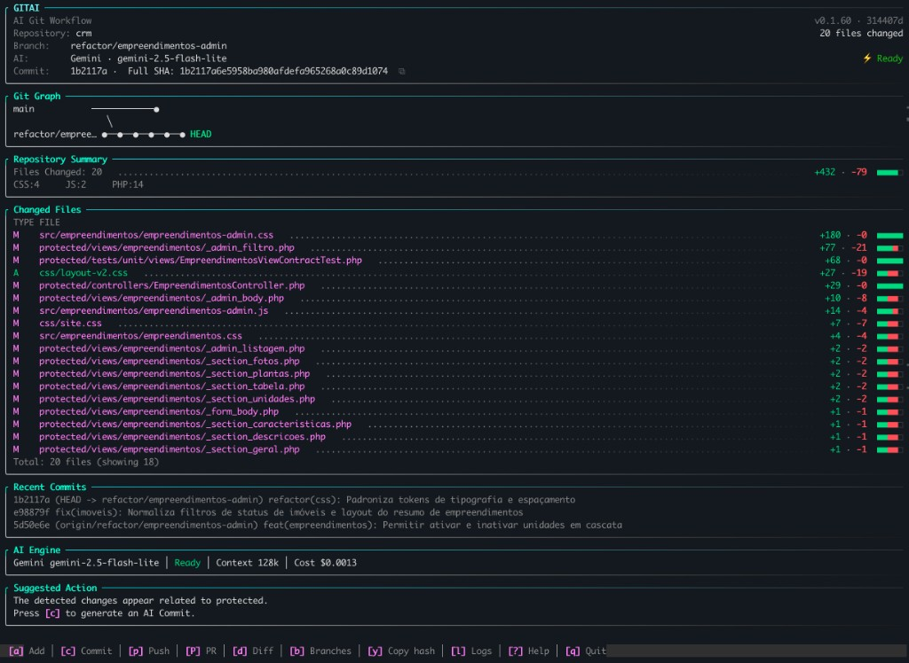

<p align="center">
  
</p>

# gitai

CLI em Go para gerar **Conventional Commits** com IA barata, automatizar **push** e criar **Pull Requests detalhados** via GitHub CLI.

---

## Sumário

- [Por quê usar o gitai?](#por-quê-usar-o-gitai)
- [Requisitos](#requisitos)
- [Instalação rápida](#instalação-rápida)
- [Dashboard TUI](#referência-de-comandos)
- [Instalação manual](#instalação-manual)
- [Atualização](#atualização)
- [Configuração](#configuração)
- [Versionamento](#versionamento)
- [Referência de comandos](#referência-de-comandos)
- [Flags globais e por comando](#flags-globais-e-por-comando)
- [Uso detalhado](#uso-detalhado)
- [Uso de tokens e custo](#uso-de-tokens-e-custo)
- [Providers de IA](#providers-de-ia)
- [Formato do commit e do PR](#formato-do-commit-e-do-pr)
- [Troubleshooting](#troubleshooting)
- [Segurança](#segurança)
- [Licença](#licença)

---

## Por quê usar o gitai?

Assistentes de IA no editor costumam gastar tokens caros para ler diff, gerar mensagem de commit e executar git. O **gitai** externaliza esse fluxo para uma IA configurável (DeepSeek via OpenRouter, GPT-4o-mini, Gemini Flash) por frações de centavo — funciona com qualquer editor ou agente (Claude Code, Copilot, terminal, etc.).

Com o gitai você obtém:

- Mensagens no padrão **Conventional Commits**
- PRs estruturados com **Summary**, **Changes**, **Test plan** e **Notes**
- Resumo de **tokens e custo** (prévia antes da IA + total após execução)
- **Relatório de gastos** (`gitai report`) com histórico em CSV
- Integração nativa com **`gh pr create`**

---

## Requisitos

| Ferramenta | Versão mínima | Para quê |
|------------|---------------|----------|
| [git](https://git-scm.com/) | qualquer recente | Repositório local, diff, commit, push |
| [Go](https://go.dev/dl/) | 1.22+ | Compilar o gitai (o `install.sh` instala automaticamente se faltar) |
| [GitHub CLI (`gh`)](https://cli.github.com/) | autenticado | Criar PR (`gitai pr`) — opcional até usar PR |

Autentique o GitHub CLI antes de usar `gitai pr`:

```bash
gh auth login
gh auth status
```

---

## Instalação rápida

### Um comando (recomendado)

O script `install.sh` executa **tudo em ordem**:

1. Verifica `git`, `curl` e `tar`
2. Instala Go em `~/sdk/go` se não houver versão compatível
3. Clona o repositório em `~/.config/gitai/repository` (ou usa o clone atual)
4. Compila e instala o binário (`go run ./cmd/gitai install`)
5. Grava `PATH` no `~/.zshrc` ou `~/.bashrc` (Go + `~/go/bin`)
6. Executa `gitai config` (wizard interativo)

**A partir do clone:**

```bash
git clone https://github.com/laerciocrestani/gitai.git
cd gitai
./install.sh
```

**Sem clonar (curl):**

```bash
curl -fsSL https://raw.githubusercontent.com/laerciocrestani/gitai/main/install.sh | bash
```

Opções do instalador:

| Opção | Descrição |
|-------|-----------|
| `--no-config` | Pula o wizard `gitai config` ao final |
| `--skip-go` | Não instala Go automaticamente (falha se ausente) |
| `--help` | Ajuda |

Variáveis úteis: `GITAI_REPO_URL`, `GITAI_INSTALL_DIR`, `GO_VERSION` (default `1.25.0`).

### Desinstalar

Remove binário, `~/.config/gitai/`, blocos de PATH no shell e (se instalado pelo `install.sh`) o Go em `~/sdk/go`:

```bash
./uninstall.sh
# ou
curl -fsSL https://raw.githubusercontent.com/laerciocrestani/gitai/main/uninstall.sh | bash
```

| Opção | Descrição |
|-------|-----------|
| `-y`, `--yes` | Não pede confirmação |
| `--remove-go` | Remove `~/sdk/go` mesmo sem marker do instalador |
| `--keep-go` | Mantém o Go em `~/sdk/go` |

**Não remove:** arquivos `.gitai.yaml` em projetos nem variáveis `GITAI_*` definidas manualmente.

O script `./scripts/setup.sh uninstall` delega para `./uninstall.sh`.

Após instalar, abra um novo terminal (ou `source ~/.zshrc`) e use:

```bash
gitai              # dashboard TUI dentro de um repo git
gitai commit
gitai pr
```

### Comandos pós-instalação

| Comando | O que faz |
|---------|-----------|
| `./install.sh` | Instalação completa (Go + binário + PATH + config) |
| `./uninstall.sh` | Remove gitai, dados e PATH do instalador |
| `gitai config` | Wizard de configuração (equivale a `gitai config init`) |
| `gitai config show` | Exibe config ativa (API key mascarada) |
| `gitai update` | Atualiza e reinstala o binário (funciona de qualquer diretório) |
| `gitai version` | Versão automática + commit + número de commits |
| `gitai report` | Relatório de uso e custos de IA (últimas 24h por padrão) |
| `gitai pricing update` | Busca preços oficiais do Gemini e salva localmente |
| `gitai status` | Alias para `git status` |

O script `./scripts/setup.sh` é um wrapper de compatibilidade que delega para `./install.sh` e `./uninstall.sh`.

### Atualizar depois

De qualquer diretório:

```bash
gitai update
```

O gitai usa o clone salvo em `~/.config/gitai/repository`, a variável `GITAI_ROOT` ou, se não encontrar clone local, baixa a última versão do GitHub automaticamente.

---

## Instalação manual

Se preferir não usar o `install.sh`:

### 1. Clonar o repositório

```bash
git clone https://github.com/laerciocrestani/gitai.git
cd gitai
```

### 2. Instalar Go 1.22+

https://go.dev/dl/ — ou deixe o `./install.sh` instalar em `~/sdk/go`.

### 3. Instalar o binário

```bash
go run ./cmd/gitai install
```

O binário é instalado em `~/go/bin/gitai` e o instalador configura o PATH.

### 4. Configurar

```bash
gitai config
```

### Alternativa sem alterar o PATH

Execute diretamente pelo caminho completo:

```bash
~/go/bin/gitai config init
~/go/bin/gitai pr
```

---

## Atualização

```bash
gitai update
```

Opcional — apontar para o seu clone local:

```bash
export GITAI_ROOT=~/projects/gitai
gitai update
```

Ou manualmente, dentro do clone:

```bash
cd gitai
git pull origin main
go install ./cmd/gitai
```

---

## Configuração

### Wizard interativo (recomendado)

```bash
gitai config
```

Equivalente a `gitai config init`.

O wizard pergunta, nesta ordem:

| Campo | Opções / default | Descrição |
|-------|------------------|-----------|
| Provedor | `openrouter`, `openai`, `gemini` | Seletor com ↑↓ e Enter |
| Modelo | sugestões + **Outro...** | Seletor; "Outro" permite digitar um modelo customizado |
| Chave API | — | Chave do provedor (Enter mantém a atual) |
| Idioma | default: `pt-BR` | Idioma das mensagens geradas |
| Branch base | default: `main` | Branch usada como base do PR |
| Co-author | opcional | Trailer adicionado ao commit |
| Limpar terminal | `s` / `n` | Limpa o console antes de cada comando gitai |

Provedor e modelo usam navegação por setas (`↑↓`) ou `j`/`k`. Fora de um TTY (CI, pipe), cai em lista numerada.

Se já existir configuração, **Enter em qualquer campo mantém o valor atual** (ex.: `[gemini]`).

Salva em `~/.config/gitai/config.yaml` com permissão `0600`.

### Arquivo de configuração global

Caminho padrão: `~/.config/gitai/config.yaml`

```yaml
provider: openrouter        # openai | gemini | openrouter
api_key: "sk-..."
model: "deepseek/deepseek-chat"
language: "pt-BR"
base_branch: "main"
co_author: ""
max_diff_bytes: 120000
clear_screen: false       # true = limpa o terminal antes de cada comando
interactive_ui: true      # true = gitai abre TUI no terminal (padrão)
ui_color: true            # cores na CLI e TUI (padrão)
ui_auto_refresh_seconds: 5   # polling do dashboard (0 = desliga)
ui_watch_files: true      # fsnotify no working tree (padrão)

# opcional — sobrescreve preços padrão do Gemini
# input_price_per_1m: 0.14
# output_price_per_1m: 0.28
```

### Config local por repositório

Crie `.gitai.yaml` na raiz do projeto. **Tem prioridade** sobre o config global.

Útil para:

- Modelo diferente por projeto
- Branch base `develop` em vez de `main`
- Idioma `en-US` em projetos open source

### Variáveis de ambiente

| Variável | Descrição |
|----------|-----------|
| `GITAI_API_KEY` | Sobrescreve `api_key` do YAML (recomendado em CI) |
| `GITAI_CONFIG` | Caminho alternativo para o arquivo de config |
| `GITAI_ROOT` | Caminho do clone gitai (usado por `gitai update` e `install.sh`) |
| `GITAI_NO_CLEAR` | Desativa limpeza do terminal (`clear_screen` ignorado) |
| `GITAI_NO_UI` | Força overview CLI em vez da TUI (`interactive_ui` ignorado) |
| `NO_COLOR` | Desativa cores ANSI (convenção Unix; ver [no-color.org](https://no-color.org)) |

Exemplo:

```bash
export GITAI_API_KEY="sk-or-v1-..."
export GITAI_CONFIG="$HOME/.config/gitai/work.yaml"
gitai pr
```

### Exibir configuração atual

```bash
gitai config show
```

A API key é **mascarada** na saída (ex.: `sk-o...abcd`).

### Referência completa dos campos

| Campo | Tipo | Obrigatório | Default | Descrição |
|-------|------|-------------|---------|-----------|
| `provider` | string | sim | `openrouter` | `openai`, `gemini` ou `openrouter` |
| `api_key` | string | sim* | — | Chave da API (* ou `GITAI_API_KEY`) |
| `model` | string | sim | depende | Identificador do modelo no provider |
| `language` | string | não | `pt-BR` | Idioma do commit e do PR |
| `base_branch` | string | não | `main` | Branch base padrão para `gitai pr` |
| `co_author` | string | não | vazio | Trailer no commit (ex.: `Co-authored-by: Nome <email@exemplo.com>`) |
| `max_diff_bytes` | int | não | `120000` | Tamanho máximo do diff enviado à IA |
| `clear_screen` | bool | não | `false` | Limpa o terminal antes de cada comando |
| `interactive_ui` | bool | não | `true` | Abre TUI ao rodar `gitai` sem subcomando |
| `ui_color` | bool | não | `true` | Cores ANSI na CLI e na TUI |
| `ui_auto_refresh_seconds` | int | não | `5` | Polling do dashboard em segundos (`0` = off) |
| `ui_watch_files` | bool | não | `true` | Observa mudanças no filesystem (fsnotify) |
| `input_price_per_1m` | float | não | — | USD por 1M tokens de input (estimativa de custo) |
| `output_price_per_1m` | float | não | — | USD por 1M tokens de output (estimativa de custo) |

### Models padrão por provider (wizard)

| Provider | Model default |
|----------|---------------|
| `openrouter` | `deepseek/deepseek-chat` |
| `openai` | `gpt-4o-mini` |
| `gemini` | `gemini-2.5-flash-lite` |

---

## Versionamento

A versão é **automática**, calculada pelo número de commits no repositório (sem tags git):

- 1º commit → `v0.1.0`
- cada commit adicional incrementa o patch → ex.: 14 commits = `v0.1.13`

```bash
gitai version
```

Exibe versão, commit, total de commits e se a árvore está dirty.

O `go install` injeta versão e commit via `-ldflags` no build.

---

## Referência de comandos

Rodar **`gitai` sem subcomando** dentro de um repositório git abre a **TUI fullscreen** (dashboard), com painéis:



- **Git Graph** — branch atual vs base
- **Repository Summary** — arquivos alterados e stats `+N · -M`
- **Changed Files** — lista com dot leaders e stats por arquivo
- **Recent Commits** — últimos 3 commits
- **AI Engine** — provider, modelo e status
- **Suggested Action** — próximo passo recomendado

### Atalhos do dashboard (TUI)

| Tecla | Ação |
|-------|------|
| `c` | Commit com IA (preview → editar → confirmar) |
| `p` | Push (preview → confirmar) |
| `P` | Pull Request com IA (preview → editar → confirmar) |
| `d` | Ver diff |
| `b` | Trocar de branch (lista + contexto + checkout) |
| `l` | Log de commits |
| `y` | Copiar hash do HEAD |
| `s` | Sync (quando behind) |
| `o` | Abrir PR no browser |
| `u` | Relatório de uso/custo de IA |
| `r` | Atualizar dashboard |
| `?` | Ajuda |
| `q` | Sair |

Commit, push e PR passam por **preview com confirmação** (`Enter` confirma, `esc` cancela). No preview, `e` edita mensagem (commit/push) ou título/corpo (PR).

Com `GITAI_NO_UI=1` ou fora de um repo git, exibe o **overview CLI** (texto ANSI).

```
gitai                 Dashboard TUI ou overview CLI (default)
├── sync              fetch + pull da branch base (--prune para limpar branches)
├── update            atualiza e reinstala o binário
├── version           versão automática + commit
├── report            relatório de uso e custos de IA
├── status            alias para git status
├── commit            gera commit com IA a partir do diff local
├── push              commit (se houver diff) + push para origin
├── pr                commit (se necessário) + push + PR detalhado via gh
├── pricing           preços Gemini (update / show / report)
│   ├── update        busca preços oficiais na web
│   ├── show          exibe preços salvos
│   └── report        alias de gitai report --all
└── config            wizard de configuração (ou subcomandos init/show)
    ├── init          wizard interativo (alias de gitai config)
    └── show          exibe config ativa (key mascarada)
```

> Instalação: `./install.sh` ou `curl -fsSL …/install.sh | bash`

### Visão geral

| Comando | O que faz | Chama IA? | Executa git? | Executa gh? |
|---------|-----------|-----------|--------------|-------------|
| `gitai` | Overview do repositório | não | leitura | não |
| `gitai sync` | Sincroniza branch base com origin | não | `fetch`, `pull` | não |
| `gitai sync --prune` | Sync + remove branches mergeadas (local e GitHub) | não | `fetch`, `pull`, `branch -d`, `push --delete` | não |
| `gitai sync --prune-remote` | Sync + remove branches mergeadas só no GitHub | não | `fetch`, `pull`, `push --delete` | não |
| `gitai version` | Exibe versão, commit e commits | não | leitura | não |
| `gitai report` | Relatório de uso/custo de IA | não | leitura | não |
| `gitai pricing update` | Atualiza tabela de preços Gemini | não | não | não |
| `gitai commit` | Commit com mensagem gerada | 1× (commit) | `add`, `commit` | não |
| `gitai push` | Commit (se houver diff) + push | 0–1× | `add`, `commit`, `push` | não |
| `gitai pr` | Commit + push + PR | 1–2× (commit + PR) | `add`, `commit`, `push` | `pr create` |
| `gitai status` | Exibe status do repositório | não | `status` | não |
| `gitai config` | Cria/atualiza config.yaml | não | não | não |
| `gitai config init` | Igual a `gitai config` | não | não | não |
| `gitai config show` | Mostra config | não | não | não |
| `gitai update` | Atualiza e reinstala binário | não | não | não |

---

## Flags globais e por comando

### Flags globais (válidas em todos os comandos)

Disponíveis em `commit`, `push` e `pr`:

| Flag | Tipo | Default | Descrição |
|------|------|---------|-----------|
| `--dry-run` | bool | `false` | Simula o fluxo: chama a IA, exibe o que seria executado, **não** roda `git commit`, `git push` nem `gh pr create` |
| `--verbose` | bool | `false` | Exibe JSON parseado da IA (type, scope, title, bullets do commit ou seções do PR) |

Exemplos:

```bash
gitai commit --dry-run
gitai pr --verbose --dry-run
gitai push --verbose
```

### Flags do `gitai commit`

| Flag | Tipo | Default | Descrição |
|------|------|---------|-----------|
| `--no-add` | bool | `false` | Não executa `git add .` — usa apenas arquivos já staged (ou unstaged como fallback) |

```bash
git add src/auth.go
gitai commit --no-add
```

### Flags do `gitai push`

Herda todas as flags de `commit`:

| Flag | Tipo | Default | Descrição |
|------|------|---------|-----------|
| `--no-add` | bool | `false` | Não executa `git add .` antes do commit |

Após o commit, executa:

```bash
git push -u origin HEAD
```

### Flags do `gitai pr`

Herda flags globais e `--no-add`, mais:

| Flag | Tipo | Default | Descrição |
|------|------|---------|-----------|
| `--no-add` | bool | `false` | Não executa `git add .` |
| `--draft` | bool | `false` | Cria o PR como **draft** (`gh pr create --draft`) |
| `--base` | string | `base_branch` do config | Branch base do PR (ex.: `main`, `develop`) |

Exemplos:

```bash
gitai pr
gitai pr --draft
gitai pr --base develop
gitai pr --no-add --draft --base main --verbose --dry-run
```

### Combinando flags

```bash
# Preview completo do fluxo pr sem alterar nada
gitai pr --dry-run --verbose

# Commit só do que já está staged, sem push
gitai commit --no-add

# PR draft contra develop, sem git add
git add .
gitai pr --no-add --draft --base develop
```

### Flags do `gitai report`

| Flag | Descrição |
|------|-----------|
| `--hour` | Última hora |
| `--hours N` | Últimas N horas |
| `--days N` | Últimos N dias |
| `--month` | Mês atual (calendário) |
| `--all` | Todo o histórico |

Padrão (sem flags): **últimas 24 horas**.

```bash
gitai report
gitai report --hour
gitai report --days 7
gitai report --all
```

---

## Uso detalhado

### Fluxo recomendado (dia a dia)

```bash
# 1. Trabalhe na sua feature branch
git checkout -b feat/minha-feature

# 2. Faça suas alterações no código

# 3. Commit + push + PR em um comando
gitai pr
```

O `gitai pr` executa internamente:

```
git add .
    ↓
[se houver alterações staged]
    → IA gera mensagem de commit → git commit
    ↓
git push -u origin HEAD
    ↓
git diff base...HEAD  (+ log de commits da branch)
    ↓
IA gera PR detalhado (title, summary, changes, test plan, notes)
    ↓
gh pr create --title "..." --body "..." --base main
    ↓
Exibe resumo de tokens e custo
```

### `gitai commit`

**Quando usar:** só quer commitar, sem push nem PR.

**Fluxo:**

1. `git add .` (salvo com `--no-add`)
2. Obtém diff staged (ou unstaged se nada staged)
3. Envia diff à IA → Conventional Commit
4. `git commit -m "..."`
5. Exibe resumo de tokens/custo

**Diff usado:** alterações locais pendentes (staged prioritário).

```bash
gitai commit
gitai commit --no-add
gitai commit --dry-run --verbose
```

**Erros comuns:**

- `nenhuma alteração para commitar` — working tree limpa
- `diretório atual não é um repositório git` — rode dentro de um repo git

---

### `gitai push`

**Quando usar:** enviar branch para origin. Se houver alterações pendentes, commita antes; senão faz push dos commits existentes.

**Na TUI:** preview com confirmação antes de executar (igual ao PR).

**Fluxo:** `git add .` (se não `--no-add`) → commit com IA (só se houver diff) → `git push -u origin HEAD`.

```bash
gitai push
gitai push --no-add
gitai push --dry-run
```

> O resumo de tokens/custo é exibido após o commit (dentro do fluxo push). O push em si não consome IA.

---

### `gitai pr` (comando principal)

**Quando usar:** finalizar trabalho na branch — commit pendente, push e PR detalhado.

**Na TUI:** preview editável (título, corpo markdown, toggle draft) com confirmação antes de criar o PR.

**Fluxo inteligente:**

| Situação | Comportamento |
|----------|---------------|
| Alterações não commitadas | `git add .` → IA gera commit → commit |
| Só commits na branch, nada pendente | Pula commit, usa commits existentes |
| Branch igual à base, sem mudanças | Erro: `nenhuma alteração em relação à main` |

**Diff usado para o PR:** `git diff base...HEAD` — **todas** as alterações da branch em relação à base, não só o último commit.

**Diff usado para o commit (quando há staged):** apenas o diff staged atual.

**Resolução da branch base:**

1. Tenta `main` (ou valor de `--base` / config)
2. Tenta `origin/main`
3. Erro se nenhuma existir → rode `git fetch`

```bash
gitai pr
gitai pr --draft
gitai pr --base develop
gitai pr --verbose --dry-run
```

**Body do PR gerado:**

```markdown
## Summary
- visão geral e impacto

## Changes
- detalhes técnicos por área

## Test plan
- [ ] passo 1
- [ ] passo 2

## Notes
- riscos ou follow-ups (se houver)
```

**Erros comuns:**

- `PR já existe: https://...` — branch já tem PR aberto
- `branch base "main" não encontrada` — rode `git fetch origin`
- `config não encontrada` — rode `gitai config init`

---

### `gitai config init`

Wizard interativo. Não altera repositórios git — só cria/atualiza o YAML global.

```bash
gitai config init
```

### `gitai config show`

Carrega a config efetiva (local `.gitai.yaml` ou global) e imprime com key mascarada.

```bash
gitai config show
```

---

## Uso de tokens e custo

### Prévia (antes da IA)

Antes do passo `Thinking`, o gitai exibe uma estimativa:

```
Estimativa: ~1750 tokens · $0.000275 USD (Gemini) (input ~1500 + output ~250)
```

### Após execução

Ao final de **`commit`**, **`push`** e **`pr`**:

```
Uso de IA
• commit: 8420 prompt + 186 completion = 8606 tokens | $0.000412 USD (Gemini)
• Total: 8606 prompt + 186 completion = 8792 tokens | custo total: $0.000412 USD
```

Cada chamada é registrada em `~/.config/gitai/usage/ledger.csv` para o `gitai report`.

### Como o custo é calculado

| Provider | Tokens | Custo |
|----------|--------|-------|
| **OpenRouter** | `usage.*` | Real via `usage.cost` (USD) |
| **OpenAI** | `usage.*` | Estimativa (preços padrão ou config) |
| **Gemini** | `usageMetadata.*` | Estimativa com preços padrão ou `gitai pricing update` |

### Preços do Gemini

```bash
gitai pricing update   # busca preços oficiais e salva em ~/.config/gitai/pricing.yaml
gitai pricing show     # exibe tabela salva
```

Modelos com preços padrão embutidos (ex.: `gemini-2.5-flash-lite` → $0.10 / $0.40 por 1M tokens).

### Estimativa manual (override)

Adicione ao config para sobrescrever qualquer provider:

```yaml
input_price_per_1m: 0.15
output_price_per_1m: 0.60
```

### Retries

| Tipo | Comportamento |
|------|---------------|
| **API indisponível** (503, 429, etc.) | Até **3 tentativas**, **3s** entre cada |
| **JSON inválido da IA** | Até 2 tentativas de parse (consome tokens extras) |

### `--dry-run`

A IA **é chamada** (você vê tokens/custo e registro no ledger), mas git/gh **não executam**.

---

## Providers de IA

| Provider | Model recomendado | Custo típico | Custo na resposta |
|----------|-------------------|--------------|-------------------|
| `openrouter` | `deepseek/deepseek-chat` | Muito barato | Sim (`usage.cost`) |
| `openai` | `gpt-4o-mini` | Barato | Não (só tokens) |
| `gemini` | `gemini-2.5-flash-lite` | Barato | Não (só tokens) |

### OpenRouter (recomendado)

```yaml
provider: openrouter
api_key: "sk-or-v1-..."
model: "deepseek/deepseek-chat"
```

Obtenha a key em: https://openrouter.ai/keys

### OpenAI

```yaml
provider: openai
api_key: "sk-..."
model: "gpt-4o-mini"
input_price_per_1m: 0.15
output_price_per_1m: 0.60
```

### Gemini

```yaml
provider: gemini
api_key: "AIza..."
model: "gemini-2.5-flash-lite"
```

Preços padrão embutidos ($0.10 input / $0.40 output por 1M tokens). Atualize com `gitai pricing update`.

---

## Formato do commit e do PR

### Conventional Commit

A IA retorna JSON e o gitai formata:

```
fix(leads): não cria clientes com corretor inválido

- evita violação da FK
- define corretor como null quando inválido

Co-authored-by: Nome <email@exemplo.com>
```

Tipos aceitos: `fix`, `feat`, `refactor`, `docs`, `test`, `chore`, `perf`, `ci`, `build`, `style`.

### Pull Request

| Seção | Conteúdo |
|-------|----------|
| **Summary** | 2–4 bullets — porquê e impacto de negócio |
| **Changes** | 3–8 bullets técnicos por área/arquivo |
| **Test plan** | Checklist acionável para validação |
| **Notes** | Riscos, breaking changes, migrations (opcional) |

---

## Troubleshooting

### `gitai: command not found`

Rode o instalador ou adicione ao PATH:

```bash
./install.sh
# ou
export PATH="$HOME/sdk/go/bin:$PATH:$HOME/go/bin"
source ~/.zshrc
```

### `config não encontrada. Execute: gitai config init`

```bash
gitai config init
```

### `api_key não configurada`

Defina no YAML ou:

```bash
export GITAI_API_KEY="sua-chave"
```

### `branch base "main" não encontrada`

```bash
git fetch origin
git branch -a   # confirme origin/main
```

Ou ajuste no config / flag:

```bash
gitai pr --base develop
```

### `PR já existe`

A branch já tem PR. Abra o link exibido ou feche/merge o PR existente.

### `gh: command not found` ou erro de autenticação

```bash
brew install gh        # macOS
gh auth login
gh auth status
```

### Diff truncado

Aumente no config:

```yaml
max_diff_bytes: 200000
```

### Custo não aparece

- Use **OpenRouter** para custo real automático
- Rode `gitai pricing update` para Gemini
- Ou configure `input_price_per_1m` e `output_price_per_1m` no YAML

### `gitai report` vazio

O ledger só é preenchido após rodar `commit`, `push` ou `pr` com IA. Verifique `~/.config/gitai/usage/ledger.csv`.

---

## Segurança

- **Nunca** commite `config.yaml` ou `.gitai.yaml` com API keys
- Adicione `.gitai.yaml` ao `.gitignore` se contiver secrets locais
- Prefira `GITAI_API_KEY` em CI e ambientes compartilhados
- `gitai config show` mascara a key (`sk-o...abcd`)
- O config global é salvo com permissão `0600` (só o usuário lê)

---

## Licença

MIT
