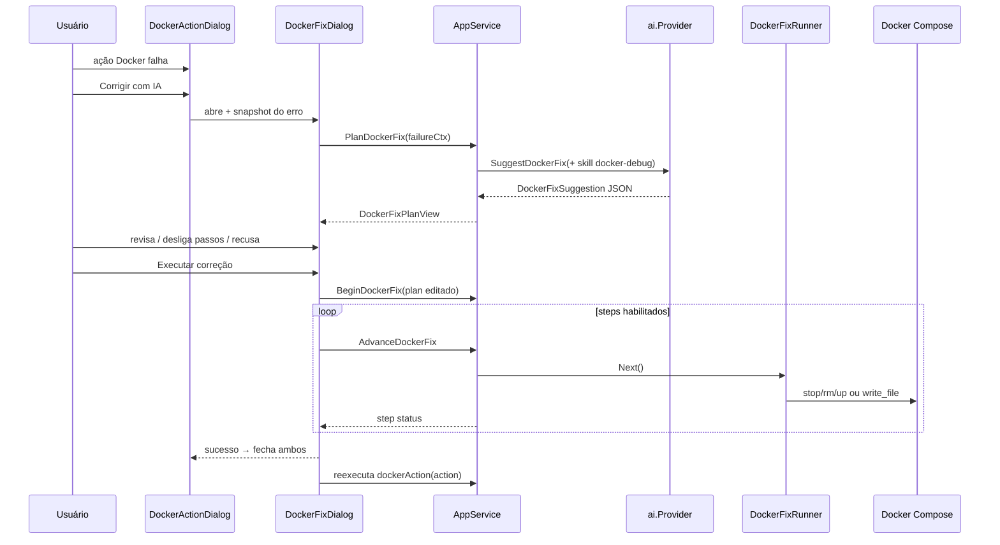

# Arquitetura — Docker: Corrigir com IA

Referência de descoberta: [`docs/discovery/resumo-docker-corrigir-com-ia.md`](../discovery/resumo-docker-corrigir-com-ia.md).

## 1. Decisão de desenho

### Reusar o quê

| Fonte | O que reusar | O que não reusar |
|-------|--------------|------------------|
| **CI Fix** (`PreviewCIFix` / `ConfirmCIFix`) | Chamada IA → JSON estruturado → preview → confirm; pending em memória; listagem de arquivos + preview | Só escreve arquivos + commit; sem steps Docker |
| **Doctor Fix** | UX de plano + timeline de execução (`Begin`/`Advance`); steps com `Risk` | Plano **determinístico** (sem IA) |
| **Skill `docker-debug`** | Playbook de diagnóstico no prompt de planejamento | Loop de chat/tools — neste fluxo a skill alimenta **só** o `SuggestDockerFix` |

**Conclusão:** feature nova `DockerFix*`, híbrida — geração como CI Fix, execução multi-step como Doctor Fix.

### ADR resumido

1. **Não** reutilizar `DoctorFixRunner` nem `ciFixPending` — domínio e contrato diferentes.
2. **MVP sem kill de processo no host** — só ações Docker Compose no projeto + `write_file`. Kill no host fica fora (risco alto / permissões); a IA pode *sugerir* em `notes` que o usuário mate o processo manualmente, sem botão que execute.
3. Plano = JSON tipado (`problem`, `resolution`, `steps[]`, `files[]`); UI permite **desligar steps**, **recusar arquivos** (toggle) e editar textos `problem`/`resolution` (opcional no MVP: só toggles + recusar dialog).
4. Dialog de falha permanece aberto atrás; no sucesso fecham ambos e reexecuta a ação original.

## 2. Fluxo (C4 container / sequência)



## 3. Modelo de dados

### Input (snapshot — não depender do dialog após close)

```go
type DockerFixFailureContext struct {
  Action      string                 // "start", "up", …
  Message     string
  Lines       []string               // log compose (truncado)
  Services    []DockerServiceStatus  // name, status, detail
  ComposeFile string                 // path relativo se conhecido
  // opcional: docker ps resumido / port bindings do dashboard
}
```

### Saída da IA (`internal/ai`)

```go
type DockerFixSuggestion struct {
  Problem    string           `json:"problem"`
  Resolution string           `json:"resolution"`
  Steps      []DockerFixStep  `json:"steps"`
  Files      []DockerFixFile  `json:"files"` // path, content, reason
  Notes      []string         `json:"notes"`
}

type DockerFixStep struct {
  ID      string `json:"id"`
  Kind    string `json:"kind"`    // docker_stop | docker_rm | docker_up | write_file
  Title   string `json:"title"`
  Target  string `json:"target"`  // service name ou path
  Risk    string `json:"risk"`    // ok | warn | destructive
  Enabled bool   `json:"enabled"` // default true; UI pode desligar
}

type DockerFixFile struct {
  Path    string `json:"path"`
  Content string `json:"content"`
  Reason  string `json:"reason"` // obrigatório — por que modifica
}
```

Kinds MVP (allowlist no executor — rejeitar kind desconhecido):

| Kind | Efeito |
|------|--------|
| `docker_stop` | `docker compose stop <service>` |
| `docker_rm` | `docker compose rm -f <service>` (warn) |
| `docker_up` | `docker compose up -d <service>` |
| `write_file` | grava `Files[]` correspondente ao `target` (path) |

`down -v` / `prune` / kill host: **não** no allowlist do MVP; skill instrui a não propor como step executável.

### Views desktop / Wails

- `DockerFixPlanView` — problem, resolution, steps, files (preview + reason + bytes), notes, message (erro de geração)
- `DockerFixAdvanceView` — step + ok + done (espelho Doctor)
- Sessão: `dockerFixSession` no `AppService` (como doctor)

## 4. Camadas

```
frontend/
  docker-action-dialog.tsx   → CTA "Corrigir com IA" só em falha
  docker-fix-dialog.tsx     → NOVO: problema, resolução, steps/files, Executar
  App.tsx                    → orquestra Plan/Begin/Advance + reexecutar

appservice.go / appservice_docker_fix.go
  PlanDockerFix / BeginDockerFix / AdvanceDockerFix

internal/desktop/docker_fix.go
  PlanDockerFix, Begin…, Advance…, map views, pending session

internal/app/docker_fix.go   (ou só desktop se fino)
  DockerFixRunner, validação allowlist, execução

internal/ai/docker_fix.go
  SuggestDockerFix, buildDockerFixPrompt, parse + retry

internal/aiskills/builtin/docker-debug.skill.md
  Refinar: pós-falha de orquestração, formato JSON do app desktop,
  porta ocupada, transparência de files.reason, kinds permitidos
```

Prompt de `SuggestDockerFix` injeta `aiskills.Get("docker-debug")` (mesmo se desabilitada no chat? **PREMISSA arquitetural:** neste fluxo a skill é **sempre** usada — é o playbook do produto para Docker Fix; o toggle do chat não desliga o botão Corrigir com IA).

## 5. UX

### DockerActionDialog (falha)

- Rodapé: único botão **Corrigir com IA**
- Sucesso / running: sem esse botão (sucesso pode manter Fechar ou só X — hoje Fechar; em falha remove Fechar)

### DockerFixDialog

1. Loading enquanto `PlanDockerFix`
2. Se erro de IA / plano vazio: mensagem + dismiss (X / fora); sem Executar
3. Se ok:
   - **Problema** (texto)
   - **Resolução** (texto)
   - Lista de **steps** com checkbox (enabled) + badge de risk
   - Seção **Arquivos** (se houver): path, reason, preview truncado; checkbox por arquivo
4. Rodapé: **Executar correção** (disabled se nenhum step/file enabled)
5. Durante execução: timeline status por step (como Doctor)
6. Sucesso: fecha Fix + Action → `dockerAction(action)` de novo
7. Falha mid-run: para no step; **não** reexecuta ação original

### Edição no MVP

- Toggle step / file = “editar”
- Recusar = fechar dialog (X / fora) sem Begin
- Textarea free-form do plano: **fora do MVP** (pode entrar depois)

## 6. Trade-offs

| Opção | Prós | Contras | Escolha |
|-------|------|---------|---------|
| Confirm one-shot (CI) | Simples | Pouco feedback em multi-step Docker | Não |
| Begin/Advance (Doctor) | Progresso claro, falha parcial | Mais bindings | **Sim** |
| Chat agent + tools | Já tem docker-debug | UX longa, imprevisível, não “plano fechado” | Não para este CTA |
| Kill no host no MVP | Resolve porta local Vite | Perigoso, OS-specific | **Não** (notes only) |
| Skill sempre on no Fix | Comportamento estável | Ignora toggle do settings | **Sim** para este fluxo |

## 7. Plano de implementação (ordem)

1. **AI:** `SuggestDockerFix` + parse/retry + testes
2. **Skill:** refinar `docker-debug.skill.md` (kinds, files.reason, pós-falha dialog)
3. **Desktop:** `PlanDockerFix` + `DockerFixRunner` (allowlist) + Begin/Advance + testes
4. **AppService** bindings
5. **UI:** `DockerFixDialog` + CTA no `docker-action-dialog` + wiring em `App.tsx` (snapshot + reexecutar)
6. **Smoke:** falha porta ocupada → plano → stop container conflitante → reexecutar start

## 8. Critérios de aceite (arquitetura)

- [ ] Botão só em falha; sem Fechar no rodapé nesse estado
- [ ] Segundo dialog com problema + resolução + files com reason
- [ ] Usuário desliga passos/arquivos ou recusa (fecha)
- [ ] Executar só muta o que ficou enabled
- [ ] Sucesso → reexecuta ação Docker original
- [ ] Falha de plano IA → mensagem, sem execução
- [ ] Nenhum kind fora do allowlist é executado

---

**Aguardando confirmação desta arquitetura (ou ajustes) antes de implementar.**
